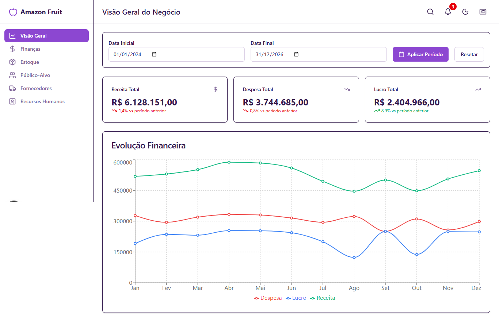
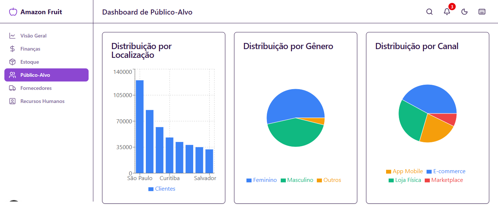
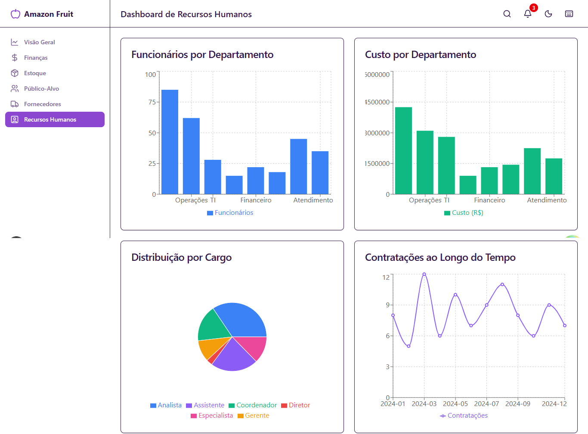
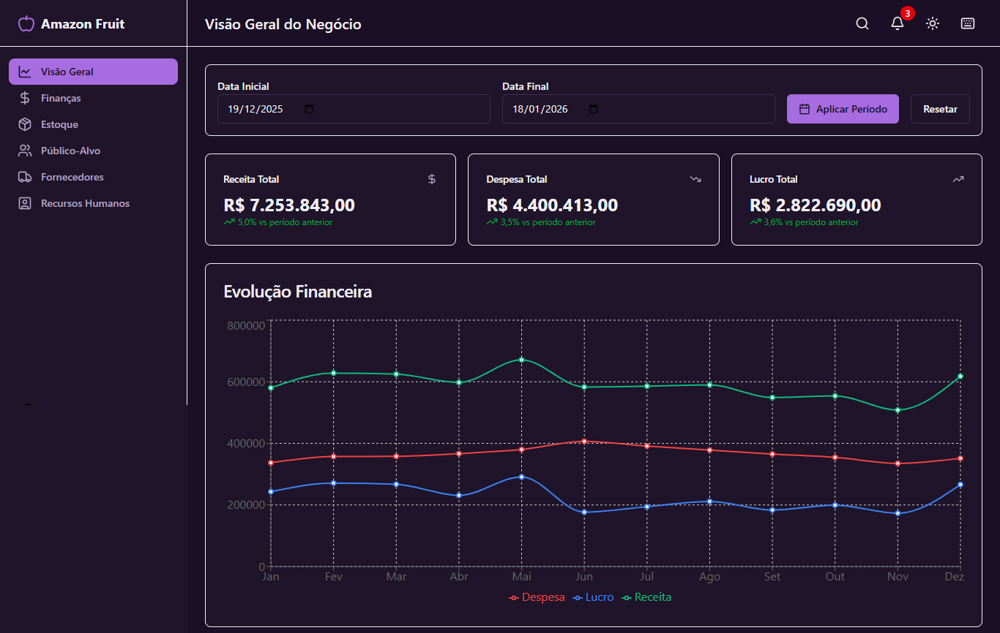

# 🍎 Amazon Fruit - Dashboard de Gestão Empresarial

> Sistema completo de dashboards para gestão de negócios, construído com Next.js 16, React 19 e TypeScript 5. Plataforma moderna com PWA, analytics e monitoramento de erros integrado.

[](https://www.typescriptlang.org/)
[](https://nextjs.org/)
[](https://reactjs.org/)
[](LICENSE)

## 📖 Sobre o Projeto

Amazon Fruit é uma aplicação web moderna e completa para gestão empresarial, oferecendo dashboards interativos e em tempo real para análise estratégica de negócios. A plataforma foi desenvolvida com foco em performance, acessibilidade e experiência do usuário.

### Objetivo

Fornecer uma solução integrada de análise de dados empresariais, permitindo que gestores tomem decisões baseadas em informações precisas e atualizadas através de uma interface intuitiva e responsiva.

### Dashboards Disponíveis

- 📊 **Dashboard Geral** - Visão geral do negócio com KPIs principais
- 💰 **Dashboard de Finanças** - Análise detalhada de receitas, despesas e fluxo de caixa
- 📦 **Dashboard de Estoque** - Controle de produtos, alertas de baixo estoque e movimentações
- 👥 **Dashboard de Público-Alvo** - Segmentação demográfica e análise de comportamento
- 🏭 **Dashboard de Fornecedores** - Ranking, avaliação de performance e histórico
- 👔 **Dashboard de RH** - Headcount, custos operacionais e gestão de contratações

## 🖼️ Demonstração

> 💡 **Nota:** Adicione suas screenshots na pasta `public/images/` e atualize os caminhos abaixo.

### 📊 Dashboard Geral

Visão geral do negócio com KPIs principais e evolução financeira em tempo real.



### 💰 Dashboard de Finanças

Análise detalhada de receitas, despesas e fluxo de caixa.


### 📦 Dashboard de Estoque

Controle de produtos, alertas de baixo estoque e movimentações.


### 👥 Dashboard de Público-Alvo

Segmentação demográfica e análise de comportamento.



### 🏭 Dashboard de Fornecedores

Ranking, avaliação de performance e histórico de fornecedores.


### 👔 Dashboard de Recursos Humanos

Headcount, custos operacionais e gestão de contratações.



### 🎨 Recursos Visuais Adicionais




## ✨ Funcionalidades Principais

### 📊 Dashboards Especializados

- **Dashboard Geral** - KPIs principais e evolução financeira em tempo real
- **Dashboard de Finanças** - Análise detalhada de receitas, despesas e fluxo de caixa
- **Dashboard de Estoque** - Controle de produtos, alertas de baixo estoque e movimentações
- **Dashboard de Público-Alvo** - Segmentação demográfica e análise de comportamento
- **Dashboard de Fornecedores** - Ranking, avaliação de performance e histórico
- **Dashboard de RH** - Headcount, custos operacionais e gestão de contratações

### 🚀 Funcionalidades Avançadas

- 🔍 **Busca Global** - Pesquisa rápida em todos os dashboards (atalho: `Ctrl+K`)
- 🔔 **Sistema de Alertas** - Notificações em tempo real para eventos importantes
- 📤 **Exportação de Dados** - Relatórios em PDF, Excel e CSV
- ⌨️ **Atalhos de Teclado** - Navegação rápida e eficiente com ajuda integrada
- 🎨 **Temas Personalizados** - Modo claro e escuro com preferências salvas no localStorage
- 🎨 **Design System** - Sistema completo de design tokens (cores, espaçamento, tipografia, sombras)
- 📱 **Design Responsivo** - Experiência otimizada para mobile e desktop
- 📱 **Progressive Web App (PWA)** - Funcionalidade offline e instalação como app nativo
- 📊 **Gráficos Interativos** - Visualizações dinâmicas com Recharts
- 🎯 **Analytics Integrado** - Rastreamento de eventos e métricas de uso
- 🛡️ **Tratamento de Erros** - Error boundaries e monitoramento com Sentry
- ♿ **Acessibilidade** - Conforme WCAG com suporte a leitores de tela
- 🚀 **Performance Otimizada** - Lazy loading, code splitting e cache inteligente
- 📚 **Documentação Completa** - Guias e exemplos em `docs/` para desenvolvimento

## 🚀 Início Rápido

### Pré-requisitos

- Node.js 20.x ou superior
- npm 10.x ou superior

### Instalação

1. **Clone o repositório:**

```bash
git clone https://github.com/seu-usuario/amazon-fruit.git
cd amazon-fruit
```

2. **Instale as dependências:**

```bash
npm install
```

3. **Configure as variáveis de ambiente:**

```bash
cp .env.example .env.local
```

Edite `.env.local` com suas configurações (o arquivo `.env.example` contém os campos necessários):

```env
# API Configuration
NEXT_PUBLIC_API_URL=http://localhost:8000
NEXT_PUBLIC_API_TIMEOUT=30000

# App Configuration
NEXT_PUBLIC_APP_NAME=Amazon Fruit
NEXT_PUBLIC_APP_VERSION=0.1.0
```

> 💡 **Nota:** As variáveis de ambiente são opcionais e têm valores padrão. Configure-as apenas se precisar de valores específicos.

4. **Inicie o servidor de desenvolvimento:**

```bash
npm run dev
```

Acesse [http://localhost:3000](http://localhost:3000) no seu navegador.

## 📚 Scripts Disponíveis

### Desenvolvimento

| Script | Descrição |
|--------|-----------|
| `npm run dev` | Inicia servidor de desenvolvimento (com webpack) |
| `npm run build` | Compila para produção |
| `npm start` | Inicia servidor de produção |
| `npm run analyze` | Analisa o tamanho do bundle |

### Qualidade de Código

| Script | Descrição |
|--------|-----------|
| `npm run lint` | Executa ESLint |
| `npm run lint:fix` | Corrige problemas do ESLint automaticamente |
| `npm run format` | Formata código com Prettier |
| `npm run format:check` | Verifica formatação do código |
| `npm run type-check` | Verifica tipos TypeScript |
| `npm run validate:tokens` | Valida design tokens do projeto |

### Testes

| Script | Descrição |
|--------|-----------|
| `npm test` | Executa todos os testes unitários |
| `npm run test:watch` | Executa testes em modo watch |
| `npm run test:coverage` | Executa testes com cobertura |

## 🛠️ Tecnologias

### Stack Principal

- **[Next.js 16.1.1](https://nextjs.org/)** - Framework React com App Router
- **[React 19.2.3](https://react.dev/)** - Biblioteca UI com Server Components
- **[TypeScript 5](https://www.typescriptlang.org/)** - Tipagem estática
- **[Geist Font](https://vercel.com/font)** - Fonte otimizada do Vercel (Geist Sans e Geist Mono)

### Bibliotecas Principais

- **[Zustand](https://zustand-demo.pmnd.rs/)** - Gerenciamento de estado global
- **[TanStack Query](https://tanstack.com/query)** - Data fetching e caching
- **[Tailwind CSS v4](https://tailwindcss.com/)** - Framework CSS utility-first
- **[Recharts](https://recharts.org/)** - Biblioteca de gráficos interativos
- **[Lucide React](https://lucide.dev/)** - Ícones SVG
- **[Sonner](https://sonner.emilkowal.ski/)** - Toast notifications

### Bibliotecas de UI e Interação

- **[Framer Motion](https://www.framer.com/motion/)** - Animações fluidas
- **[React Hook Form](https://react-hook-form.com/)** - Gerenciamento de formulários
- **[Zod 4.3.5](https://zod.dev/)** - Validação de esquemas TypeScript-first
- **[date-fns](https://date-fns.org/)** - Manipulação de datas
- **[Axios](https://axios-http.com/)** - Cliente HTTP
- **[Class Variance Authority](https://cva.style/)** - Variantes de componentes
- **[clsx](https://github.com/lukeed/clsx)** - Utilitário para classes CSS condicionais
- **[tailwind-merge](https://github.com/dcastil/tailwind-merge)** - Merge de classes Tailwind

### Ferramentas de Desenvolvimento

- **[Jest](https://jestjs.org/)** - Framework de testes unitários
- **[Testing Library](https://testing-library.com/)** - Testes de componentes React
- **[ESLint](https://eslint.org/)** - Linter com configuração Next.js
- **[Prettier](https://prettier.io/)** - Formatador de código
- **[Husky](https://typicode.github.io/husky/)** - Git hooks
- **[lint-staged](https://github.com/lint-staged/lint-staged)** - Lint em arquivos staged

### Ferramentas de Produção

- **[Sentry](https://sentry.io/)** - Monitoramento de erros e performance
- **[Next PWA](https://github.com/shadowwalker/next-pwa)** - Suporte a Progressive Web App
- **[Bundle Analyzer](https://github.com/vercel/next.js/tree/canary/packages/next-bundle-analyzer)** - Análise de bundle
- **[React Error Boundary](https://github.com/bvaughn/react-error-boundary)** - Tratamento de erros React

### Design System

- **Design Tokens** - Sistema completo de tokens de design (cores, espaçamento, tipografia, sombras, bordas, transições, z-index, breakpoints)
- **Componentes Typography** - Sistema tipográfico completo e acessível
- **Tailwind CSS v4** - Framework CSS com configuração customizada e plugins

## 🧪 Testes

O projeto possui uma suíte completa de testes para garantir qualidade e confiabilidade do código.

### Estrutura de Testes

```
tests/
├── unit/              # Testes unitários de componentes e funções
├── fixtures/         # Dados de teste e mocks
├── helpers/          # Utilitários para testes
└── templates/        # Templates para criar novos testes
```

### Executando Testes

```bash
# Todos os testes unitários
npm test

# Testes em modo watch (desenvolvimento)
npm run test:watch

# Testes com cobertura de código
npm run test:coverage
```

### Tipos de Testes

- **Testes Unitários** - Testam componentes e funções isoladamente

### Cobertura de Testes

O projeto utiliza Jest para cobertura de código. Execute `npm run test:coverage` para gerar relatórios detalhados. O projeto mantém um threshold mínimo de 50% de cobertura para branches, functions, lines e statements.

## 📚 Documentação

O projeto possui documentação completa e organizada na pasta `docs/`:

### Estrutura da Documentação

- **`docs/components/`** - Documentação de componentes UI (Button, Card, Input)
- **`docs/design-tokens/`** - Documentação completa do sistema de design tokens
  - Cores, espaçamento, tipografia, sombras, bordas, transições, z-index, breakpoints
- **`docs/guides/`** - Guias de desenvolvimento
  - Acessibilidade, dark mode, ferramentas de desenvolvimento, performance, Tailwind, utilitários
- **`docs/examples/`** - Exemplos de padrões comuns de uso
- **`docs/testing.md`** - Guia completo de testes

### Acessando a Documentação

A documentação está disponível em formato Markdown e pode ser visualizada diretamente no GitHub ou através de qualquer visualizador Markdown. Para contribuir com a documentação, edite os arquivos em `docs/` seguindo o padrão existente.

## 🚀 Deploy

### Vercel (Recomendado)

O projeto está otimizado para deploy na Vercel, plataforma oficial do Next.js:

1. **Faça push do código para o GitHub**
2. **Conecte o repositório na [Vercel](https://vercel.com)**
3. **Configure as variáveis de ambiente** no painel da Vercel:
   - `NEXT_PUBLIC_API_URL`
   - `NEXT_PUBLIC_APP_NAME`
   - `NEXT_PUBLIC_APP_VERSION`
4. **Deploy automático** a cada push para a branch principal!

### Docker

Para deploy com Docker:

```bash
# Build da imagem
docker build -t amazon-fruit .

# Executar container
docker run -p 3000:3000 amazon-fruit

# Ou com Docker Compose
docker-compose up -d
```

O projeto inclui `Dockerfile` e `docker-compose.yml` configurados e prontos para uso.

### Outras Plataformas

O projeto é compatível com várias plataformas de deploy:

- **Netlify** - Compatível com SSG/SSR do Next.js
- **Railway** - Deploy simplificado com Docker
- **AWS Amplify** - Deploy serverless
- **Azure Static Web Apps** - Hosting estático e serverless
- **Google Cloud Run** - Containers serverless

## 📁 Estrutura do Projeto

```
amazon-fruit/
├── src/
│   ├── app/                          # App Router (Next.js 16)
│   │   ├── (dashboards)/             # Rotas agrupadas dos dashboards
│   │   │   ├── geral/                # Dashboard geral
│   │   │   ├── financas/             # Dashboard de finanças
│   │   │   ├── estoque/              # Dashboard de estoque
│   │   │   ├── publico-alvo/         # Dashboard de público-alvo
│   │   │   ├── fornecedores/         # Dashboard de fornecedores
│   │   │   └── recursos-humanos/     # Dashboard de RH
│   │   ├── api/                      # API Routes
│   │   │   └── health/               # Endpoint de health check
│   │   ├── layout.tsx                # Layout raiz
│   │   ├── page.tsx                  # Página inicial
│   │   ├── error.tsx                 # Página de erro
│   │   ├── robots.ts                 # Configuração de robots.txt
│   │   └── sitemap.ts                # Geração de sitemap
│   ├── components/                   # Componentes React
│   │   ├── charts/                   # Componentes de gráficos (Recharts)
│   │   ├── dashboards/               # Componentes específicos de dashboards
│   │   ├── features/                 # Features complexas
│   │   │   ├── alerts/               # Sistema de alertas
│   │   │   ├── export/               # Exportação de dados
│   │   │   ├── keyboard/             # Atalhos de teclado
│   │   │   └── search/               # Busca global
│   │   ├── layouts/                  # Layouts (header, sidebar, footer)
│   │   ├── onboarding/               # Componentes de onboarding
│   │   ├── typography/               # Componentes tipográficos
│   │   ├── ui/                       # Componentes UI base
│   │   │   └── skeletons/             # Componentes de skeleton loading
│   │   ├── error-boundary.tsx        # Error boundary global
│   │   └── offline-indicator.tsx     # Indicador de status offline
│   ├── lib/                          # Bibliotecas e utilidades
│   │   ├── analytics/                # Rastreamento de eventos
│   │   ├── api/                      # Cliente API e serviços
│   │   ├── constants/                # Constantes do projeto
│   │   ├── design-tokens/            # Sistema de design tokens
│   │   │   ├── colors.ts             # Tokens de cores
│   │   │   ├── spacing.ts            # Tokens de espaçamento
│   │   │   ├── typography.ts         # Tokens tipográficos
│   │   │   ├── shadows.ts            # Tokens de sombras
│   │   │   ├── borders.ts            # Tokens de bordas
│   │   │   ├── transitions.ts         # Tokens de transições
│   │   │   ├── z-index.ts            # Tokens de z-index
│   │   │   └── breakpoints.ts        # Tokens de breakpoints
│   │   ├── hooks/                    # Hooks customizados React
│   │   ├── providers/                # Context providers (Query, Theme)
│   │   ├── tailwind/                 # Configurações e plugins Tailwind
│   │   ├── utils/                    # Funções utilitárias
│   │   └── validation/               # Schemas de validação (Zod)
│   ├── store/                        # Zustand stores (estado global)
│   ├── styles/                       # Estilos globais e tokens
│   └── types/                        # Definições TypeScript
├── docs/                             # Documentação do projeto
│   ├── components/                   # Documentação de componentes
│   ├── design-tokens/                # Documentação de design tokens
│   ├── examples/                     # Exemplos de uso
│   ├── guides/                       # Guias de desenvolvimento
│   └── testing.md                    # Guia de testes
├── scripts/                          # Scripts utilitários
│   └── validate-tokens.ts            # Validador de design tokens
├── public/                           # Assets estáticos
│   ├── images/                       # Screenshots e imagens
│   ├── icons/                        # Ícones PWA
│   ├── manifest.json                 # Manifest PWA
│   └── offline.html                  # Página offline do PWA
├── tests/                            # Testes
│   ├── fixtures/                     # Dados de teste
│   ├── helpers/                      # Utilitários de teste
│   ├── templates/                    # Templates de teste
│   └── unit/                         # Testes unitários
├── coverage/                         # Relatórios de cobertura (gerado)
└── [config files]                    # Arquivos de configuração
```

### Padrões de Código

O projeto segue padrões rigorosos de qualidade:

- ✅ **TypeScript strict mode** - Tipagem forte e segura
- ✅ **ESLint** - Linter configurado com regras do Next.js
- ✅ **Prettier** - Formatação automática de código
- ✅ **Husky + lint-staged** - Hooks Git para garantir qualidade
- ✅ **Conventional Commits** - Padrão de mensagens de commit
- ✅ **Testes obrigatórios** - Novas features devem incluir testes
- ✅ **Acessibilidade** - Componentes acessíveis (WCAG)
- ✅ **Performance** - Otimizações de bundle e lazy loading

## 🔧 Configuração Avançada

### Variáveis de Ambiente

O projeto utiliza variáveis de ambiente para configuração. Crie um arquivo `.env.local` baseado no `.env.example`:

```env
# API Configuration
NEXT_PUBLIC_API_URL=http://localhost:8000
NEXT_PUBLIC_API_TIMEOUT=30000

# App Configuration
NEXT_PUBLIC_APP_NAME=Amazon Fruit
NEXT_PUBLIC_APP_VERSION=0.1.0
```

> 💡 **Nota:** As variáveis de ambiente são opcionais. O projeto funciona sem configuração adicional, mas você pode personalizar conforme necessário.

### PWA (Progressive Web App)

O projeto está configurado como PWA, permitindo:
- Instalação como app nativo
- Funcionalidade offline com página offline customizada
- Cache inteligente de assets (fontes, imagens, APIs, páginas)
- Notificações push (quando configurado)
- Service Worker automático com estratégias de cache otimizadas

### Design Tokens

O projeto possui um sistema completo de design tokens organizado em `src/lib/design-tokens/`:

- **Cores** - Paleta completa com suporte a tema claro/escuro
- **Espaçamento** - Sistema de espaçamento semântico e consistente
- **Tipografia** - Escala tipográfica e tokens de fonte
- **Sombras** - Sistema de elevação e sombras
- **Bordas** - Raio de borda e estilos
- **Transições** - Durações e easings padronizados
- **Z-Index** - Camadas de z-index organizadas
- **Breakpoints** - Sistema responsivo consistente

Os tokens são validados através do script `npm run validate:tokens` e documentados em `docs/design-tokens/`.

## 📝 Licença

Este projeto está sob a licença MIT. Veja o arquivo [LICENSE](LICENSE) para mais detalhes.

## 👤 Autor

**Jonata Jesus**

- GitHub: [@jonata1200](https://github.com/jonata1200)

---

⭐ Se este projeto foi útil para você, considere dar uma estrela no repositório!
