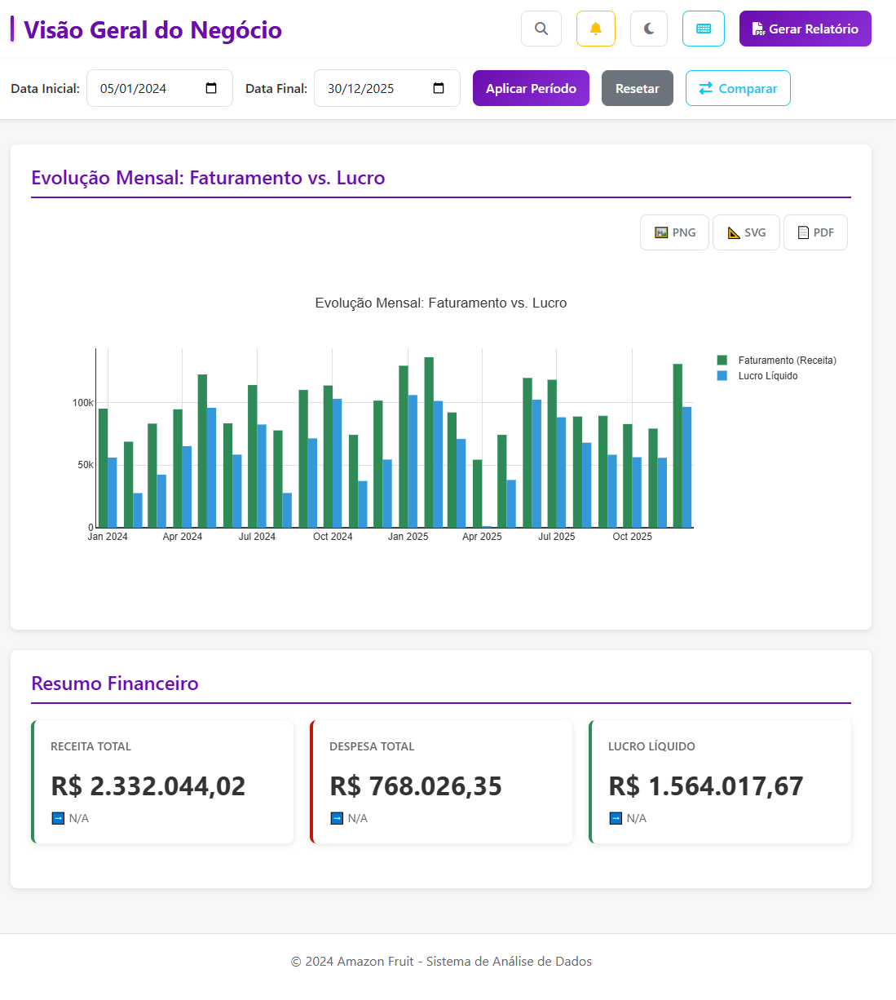
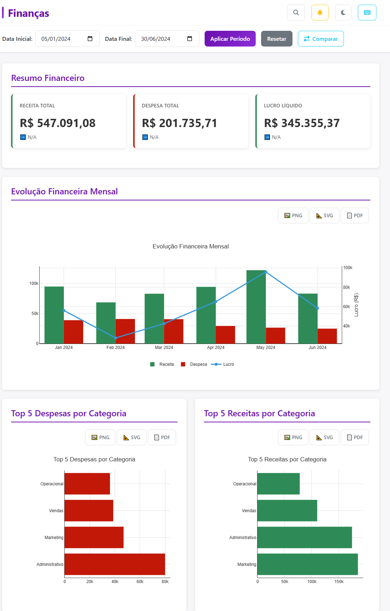
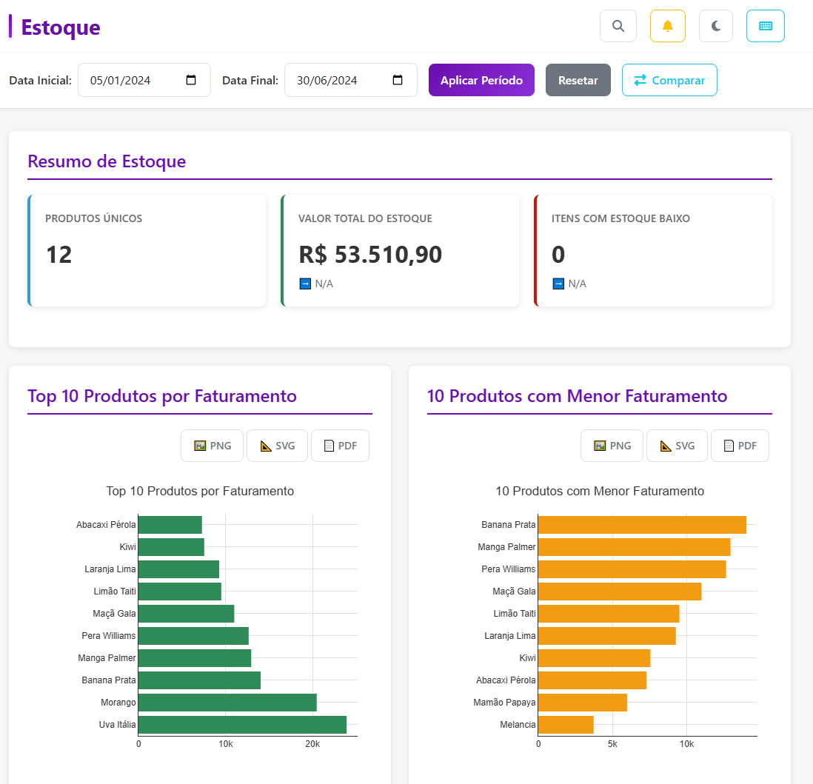
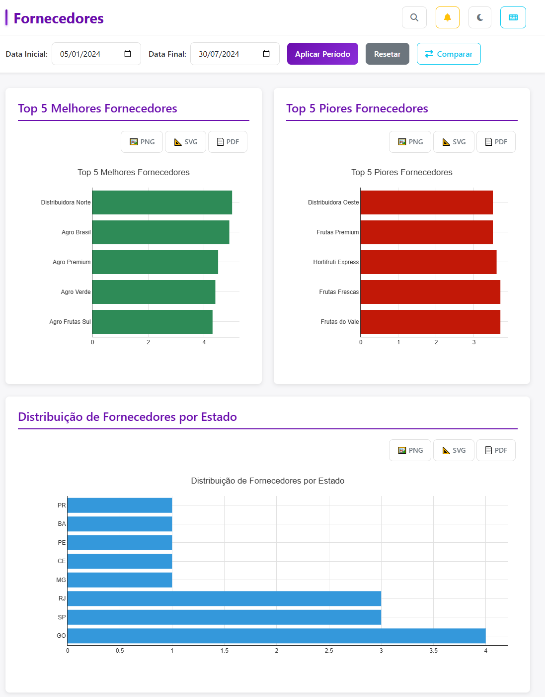
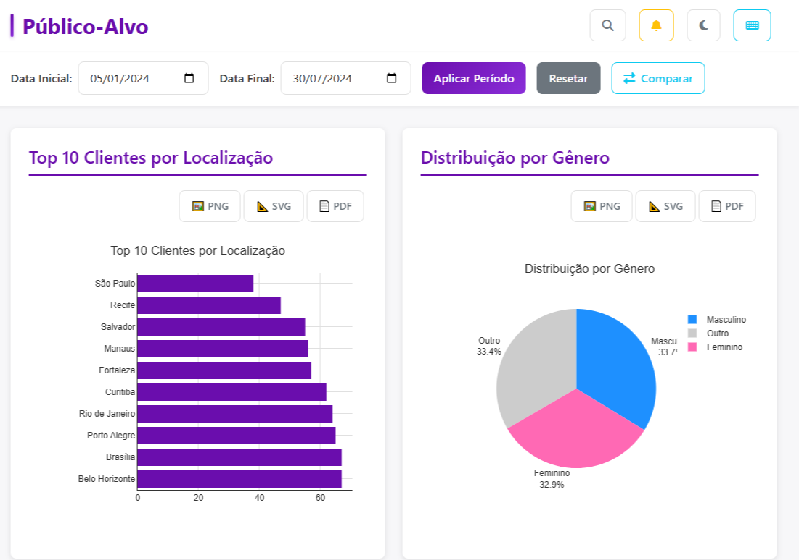
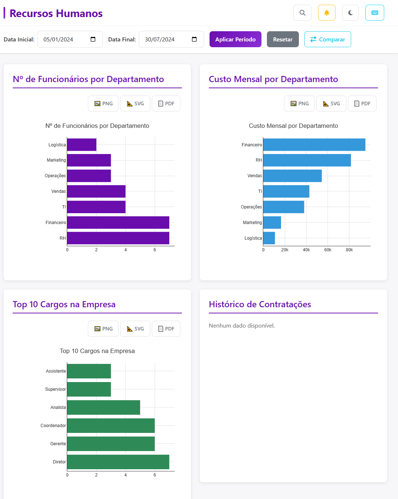

# 🍎 Amazon Fruit - Sistema de Análise de Dados


## 📖 Descrição do Projeto

O **Amazon Fruit** é uma aplicação web moderna e completa para análise de dados empresariais, desenvolvida para fornecer insights estratégicos através de dashboards interativos e visualizações dinâmicas. O sistema permite que gestores e analistas monitorem e analisem métricas críticas de diferentes áreas do negócio, incluindo finanças, estoque, fornecedores, público-alvo e recursos humanos.

### 🎯 Problema que Resolve

Em um ambiente empresarial, a tomada de decisões baseada em dados é essencial, mas muitas vezes os dados estão dispersos em diferentes fontes e formatos. O Amazon Fruit centraliza essas informações em uma única plataforma, oferecendo:

- **Visualização unificada** de métricas de múltiplas áreas do negócio
- **Análises comparativas** entre períodos para identificar tendências
- **Alertas automáticos** sobre situações críticas que requerem atenção
- **Exportação de relatórios** em múltiplos formatos (PDF, Excel)
- **Interface responsiva** e acessível, funcionando em diferentes dispositivos

### 💡 Por que é Útil?

- ✅ **Eficiência**: Reduz o tempo necessário para compilar e analisar dados
- ✅ **Precisão**: Elimina erros manuais de cálculo e agregação
- ✅ **Acessibilidade**: Interface intuitiva que não requer conhecimento técnico avançado
- ✅ **Flexibilidade**: Filtros e comparações personalizáveis por período
- ✅ **Escalabilidade**: Arquitetura preparada para crescer com o negócio

---

## 📸 Screenshots / Demonstração

### Dashboard Principal - Visão Geral
 <!-- Insira aqui um print da tela do dashboard geral mostrando KPIs e gráficos de evolução -->

### Dashboard de Finanças
 <!-- Insira aqui um print da tela do dashboard de finanças com gráficos de receita, despesa e lucro -->

### Dashboard de Estoque
 <!-- Insira aqui um print da tela do dashboard de estoque mostrando produtos mais vendidos e alertas de ruptura -->

### Dashboard de Fornecedores
 <!-- Insira aqui um print da tela do dashboard de fornecedores com ranking e distribuição geográfica -->

### Dashboard de Público-Alvo
 <!-- Insira aqui um print da tela do dashboard de público-alvo com análises demográficas -->

### Dashboard de Recursos Humanos
 <!-- Insira aqui um print da tela do dashboard de recursos humanos com métricas de headcount e custos -->

---

## ✨ Funcionalidades Principais

### 📊 Dashboards Interativos

- **Visão Geral**: Panorama consolidado do negócio com KPIs principais e evolução temporal
- **Finanças**: Análise detalhada de receitas, despesas, lucros e tendências financeiras
- **Estoque**: Monitoramento de produtos mais/menos vendidos, alertas de ruptura e gestão de inventário
- **Fornecedores**: Ranking de fornecedores, análise geográfica e performance de entregas
- **Público-Alvo**: Análise demográfica, distribuição por localização, gênero e canais de venda
- **Recursos Humanos**: Métricas de headcount, custos de pessoal, distribuição por função e histórico de contratações

### 🔍 Recursos de Análise

- **Filtros por Período**: Selecione intervalos de datas personalizados para análise
- **Comparação Temporal**: Compare métricas entre períodos diferentes (atual vs. anterior)
- **Busca Global**: Pesquise rapidamente por qualquer informação nos dashboards
- **Gráficos Interativos**: Visualizações dinâmicas com Plotly.js que permitem zoom, hover e exportação

### 🚨 Sistema de Alertas

- **Alertas Inteligentes**: Notificações automáticas sobre situações críticas
- **Categorização**: Alertas organizados por tipo e prioridade
- **Badge de Contagem**: Indicador visual do número de alertas pendentes
- **Painel Dedicado**: Interface centralizada para gerenciar todos os alertas

### 📤 Exportação de Dados

- **Relatórios PDF**: Geração de relatórios completos em formato PDF
- **Exportação Excel**: Exportação de dados brutos e análises para planilhas Excel
- **Gráficos Exportáveis**: Download de gráficos em formato de imagem

### 🎨 Interface e Experiência do Usuário

- **Modo Escuro/Claro**: Alternância entre temas para melhor conforto visual
- **Design Responsivo**: Interface adaptável para desktop, tablet e mobile
- **Atalhos de Teclado**: Navegação rápida via teclado (Ctrl+F para busca, Ctrl+T para tema, etc.)
- **Acessibilidade**: Suporte a leitores de tela e navegação por teclado
- **Loading States**: Indicadores visuais durante carregamento de dados

### 🔒 Segurança e Performance

- **Rate Limiting**: Proteção contra abuso de API
- **CORS Configurado**: Controle de acesso cross-origin
- **Compressão GZip**: Otimização de transferência de dados
- **Cache Inteligente**: Redução de chamadas desnecessárias à API
- **Health Checks**: Monitoramento de saúde da aplicação

---

## 🛠️ Tecnologias Utilizadas

### Backend

| Tecnologia | Versão | Propósito |
|------------|--------|-----------|
| **Python** | 3.11+ | Linguagem principal |
| **FastAPI** | 0.104.1 | Framework web moderno e rápido |
| **Uvicorn** | 0.24.0 | Servidor ASGI de alta performance |
| **SQLAlchemy** | 2.0.23 | ORM para acesso ao banco de dados |
| **aiosqlite** | 0.19.0 | Driver assíncrono para SQLite |
| **Pandas** | 2.3.3 | Manipulação e análise de dados |
| **NumPy** | 2.3.4 | Computação numérica |
| **Plotly** | 5.18.0 | Geração de gráficos interativos |
| **Kaleido** | 0.2.1 | Exportação de gráficos Plotly |
| **OpenPyXL** | 3.1.2 | Geração de arquivos Excel |
| **ReportLab** | 4.4.4 | Geração de relatórios PDF |
| **Pytest** | 7.4.3 | Framework de testes |
| **Pytest-asyncio** | 0.21.1 | Suporte a testes assíncronos |

### Frontend

| Tecnologia | Versão | Propósito |
|------------|--------|-----------|
| **HTML5** | - | Estrutura das páginas |
| **CSS3** | - | Estilização e design system |
| **JavaScript (ES6+)** | - | Lógica e interatividade |
| **Bootstrap 5** | 5.3.0 | Framework CSS responsivo |
| **Font Awesome** | 6.4.0 | Ícones e símbolos |
| **Plotly.js** | Latest | Gráficos interativos no navegador |

### Banco de Dados

- **SQLite 3**: Banco de dados relacional leve e embutido

### Infraestrutura e DevOps

- **Docker**: Containerização da aplicação
- **Docker Compose**: Orquestração de containers
- **Nginx**: Reverse proxy e servidor web (opcional)
- **Git**: Controle de versão

### Ferramentas de Desenvolvimento

- **Python-dateutil**: Manipulação de datas
- **Pytz**: Suporte a fusos horários
- **Requests**: Cliente HTTP para testes

---

## 📋 Pré-requisitos

Antes de começar, certifique-se de ter instalado em sua máquina:

### Obrigatórios

- **Python 3.11 ou superior** ([Download](https://www.python.org/downloads/))
- **Git** ([Download](https://git-scm.com/downloads))
- **SQLite3** (geralmente incluído com Python)

### Opcionais (mas recomendados)

- **Docker** ([Download](https://www.docker.com/get-started)) - Para execução via containers
- **Docker Compose** - Geralmente incluído com Docker Desktop
- **Editor de código** (VS Code, PyCharm, etc.)

### Verificação de Instalação

```bash
# Verificar Python
python --version  # Deve mostrar Python 3.11 ou superior

# Verificar Git
git --version

# Verificar Docker (opcional)
docker --version
docker-compose --version
```

---

## 🚀 Instalação e Execução

### Método 1: Instalação Local (Desenvolvimento)

#### Passo 1: Clonar o Repositório

```bash
git clone <url-do-repositorio>
cd amazon-fruit
```

#### Passo 2: Criar Ambiente Virtual

**Windows:**
```powershell
python -m venv venv
venv\Scripts\activate
```

**Linux/Mac:**
```bash
python3 -m venv venv
source venv/bin/activate
```

#### Passo 3: Instalar Dependências

```bash
pip install --upgrade pip
pip install -r backend/requirements.txt
```

#### Passo 4: Configurar Variáveis de Ambiente (Opcional)

Crie um arquivo `.env` na raiz do projeto (os valores padrão funcionam para desenvolvimento):

```env
ENVIRONMENT=development
DEBUG=True
DB_PATH=./data/amazon_fruit.db
API_HOST=127.0.0.1
API_PORT=8000
CORS_ORIGINS=http://localhost:8000,http://127.0.0.1:8000
```

#### Passo 5: Verificar Banco de Dados

```bash
# Verificar se o banco de dados existe
# Windows
Test-Path data\amazon_fruit.db

# Linux/Mac
ls -la data/amazon_fruit.db
```

Se o banco não existir, você precisará importar os dados. Consulte a seção de scripts utilitários.

#### Passo 6: Executar a Aplicação

**Windows:**
```powershell
cd backend
python -m uvicorn app.main:app --reload --host 127.0.0.1 --port 8000
```

**Linux/Mac:**
```bash
cd backend
python -m uvicorn app.main:app --reload --host 127.0.0.1 --port 8000
```

**Usando Scripts de Inicialização:**

**Windows:**
```powershell
.\start-server.ps1
# ou
.\start-server-quick.ps1
```

**Linux/Mac:**
```bash
chmod +x start-server.sh
./start-server.sh
```

#### Passo 7: Acessar a Aplicação

Abra seu navegador e acesse:

- **Interface Principal**: http://localhost:8000
- **Documentação da API (Swagger)**: http://localhost:8000/docs
- **Documentação Alternativa (ReDoc)**: http://localhost:8000/redoc
- **Health Check**: http://localhost:8000/api/health

### Método 2: Instalação com Docker

#### Passo 1: Build da Imagem

```bash
docker build -t amazon-fruit .
```

#### Passo 2: Executar com Docker Compose

```bash
# Desenvolvimento
docker-compose up

# Produção (em background)
docker-compose up -d
```

#### Passo 3: Acessar a Aplicação

A aplicação estará disponível em http://localhost:8000

Para parar os containers:

```bash
docker-compose down
```

---

## 📁 Estrutura do Projeto

```
amazon-fruit/
├── backend/                    # Código do backend (FastAPI)
│   ├── app/
│   │   ├── api/
│   │   │   └── routes/        # Rotas da API REST
│   │   │       ├── alerts.py      # Endpoints de alertas
│   │   │       ├── analysis.py   # Endpoints de análise
│   │   │       ├── charts.py     # Endpoints de gráficos
│   │   │       ├── dashboard.py  # Endpoints de dashboards
│   │   │       ├── data.py       # Endpoints de dados
│   │   │       ├── export.py     # Endpoints de exportação
│   │   │       └── search.py     # Endpoints de busca
│   │   ├── config.py           # Configurações da aplicação
│   │   ├── main.py             # Aplicação FastAPI principal
│   │   ├── middleware/         # Middlewares customizados
│   │   │   └── rate_limit.py   # Rate limiting
│   │   ├── services/           # Lógica de negócio
│   │   │   ├── analysis/       # Módulos de análise por área
│   │   │   │   ├── financial_analysis.py
│   │   │   │   ├── hr_analysis.py
│   │   │   │   ├── inventory_analysis.py
│   │   │   │   ├── public_analysis.py
│   │   │   │   └── suppliers_analysis.py
│   │   │   ├── charts/         # Geração de gráficos Plotly
│   │   │   │   ├── finance_charts.py
│   │   │   │   ├── general_charts.py
│   │   │   │   ├── hr_charts.py
│   │   │   │   ├── inventory_charts.py
│   │   │   │   ├── public_charts.py
│   │   │   │   └── suppliers_charts.py
│   │   │   └── data_handler.py # Handler de acesso ao banco
│   │   └── utils/              # Utilitários
│   │       ├── logging_config.py
│   │       ├── validators.py
│   │       └── warmup.py
│   └── requirements.txt        # Dependências Python
│
├── frontend/                   # Código do frontend
│   ├── static/
│   │   ├── css/               # Estilos CSS organizados
│   │   │   ├── base.css
│   │   │   ├── main.css
│   │   │   ├── dark-mode.css
│   │   │   ├── responsive.css
│   │   │   ├── variables.css
│   │   │   └── components/   # Estilos de componentes
│   │   └── js/                # JavaScript organizado
│   │       ├── app.js        # Aplicação principal
│   │       ├── filters.js    # Lógica de filtros
│   │       ├── core/         # Módulos core
│   │       ├── dashboards/  # Lógica específica de cada dashboard
│   │       └── modules/      # Módulos funcionais
│   └── templates/            # Templates HTML
│       ├── base.html         # Template base
│       ├── index.html        # Página inicial
│       └── dashboards/       # Templates de dashboards
│
├── data/                      # Dados e banco de dados
│   └── amazon_fruit.db       # Banco SQLite
│
├── docs/                      # Documentação
│   ├── DEPLOY.md            # Guia de deploy
│   ├── DESIGN_SYSTEM.md     # Design system
│   ├── INSTALL.md           # Guia de instalação
│   ├── RUN.md               # Guia de execução
│   └── TROUBLESHOOTING.md   # Solução de problemas
│
├── nginx/                     # Configuração Nginx (opcional)
│   ├── nginx.conf
│   └── conf.d/
│
├── scripts/                   # Scripts utilitários
│   ├── apply_validations.py
│   ├── backup_database.ps1
│   ├── backup_database.sh
│   ├── check_excel_columns.py
│   ├── generate_test_data.py
│   ├── migrate_excel_to_sqlite.py
│   ├── run_tests.ps1
│   ├── run_tests.sh
│   └── test_docker_build.*
│
├── tests/                     # Testes automatizados
│   ├── test_integration.py
│   ├── test_performance.py
│   └── test_security.py
│
├── logs/                      # Logs da aplicação
│
├── docker-compose.yml         # Configuração Docker Compose
├── Dockerfile                 # Imagem Docker
├── start-server.sh            # Script de inicialização (Linux/Mac)
├── start-server.ps1           # Script de inicialização (Windows)
├── start-server-quick.ps1     # Script rápido (Windows)
└── README.md                  # Este arquivo
```

### Explicação das Pastas Principais

- **`backend/app/`**: Contém toda a lógica do backend, organizada em rotas, serviços e utilitários
- **`frontend/static/`**: Arquivos estáticos (CSS, JavaScript) organizados por funcionalidade
- **`frontend/templates/`**: Templates HTML que são servidos pela aplicação
- **`data/`**: Banco de dados SQLite e arquivos de dados
- **`docs/`**: Documentação técnica detalhada
- **`scripts/`**: Scripts auxiliares para migração, testes e manutenção
- **`tests/`**: Testes automatizados da aplicação

---

## 📄 Licença

Este projeto está sob a licença **MIT**. Veja o arquivo `LICENSE` para mais detalhes.

---

## 👤 Autor

**Equipe Amazon Fruit**

- Desenvolvido com ❤️ para facilitar a análise de dados empresariais da Amazon Fruit

---

## 📞 Suporte e Contato

### Documentação Adicional

- 📖 [Guia de Instalação](docs/INSTALL.md) - Instruções detalhadas de instalação
- 🚀 [Guia de Execução](docs/RUN.md) - Como executar a aplicação
- 🚢 [Guia de Deploy](docs/DEPLOY.md) - Deploy em produção
- 🔧 [Solução de Problemas](docs/TROUBLESHOOTING.md) - Troubleshooting comum
- 🎨 [Design System](docs/DESIGN_SYSTEM.md) - Padrões de design

### 🔄 Plano de Migração para React + Next.js + TypeScript

Um plano completo e detalhado de migração está disponível, dividido em 8 fases:

- 📋 **[Visão Geral do Plano de Migração](docs/MIGRATION_PLAN_OVERVIEW.md)** - Introdução e estratégia geral
- **[Fase 1: Preparação e Setup Inicial](docs/MIGRATION_PHASE_1.md)** - Setup do projeto Next.js (2-3 dias)
- **[Fase 2: Infraestrutura e Configurações](docs/MIGRATION_PHASE_2.md)** - API, Estado e Config (3-5 dias)
- **[Fase 3: Componentes Base e Design System](docs/MIGRATION_PHASE_3.md)** - UI Components (5-7 dias)
- **[Fase 4: Dashboards - Parte 1](docs/MIGRATION_PHASE_4.md)** - Geral e Finanças (7-10 dias)
- **[Fase 5: Dashboards - Parte 2](docs/MIGRATION_PHASE_5.md)** - Demais Dashboards (7-10 dias)
- **[Fase 6: Funcionalidades Avançadas](docs/MIGRATION_PHASE_6.md)** - Alertas, Busca, Export (5-7 dias)
- **[Fase 7: Integração e Testes](docs/MIGRATION_PHASE_7.md)** - Testes Completos (5-7 dias)
- **[Fase 8: Deploy e Otimização](docs/MIGRATION_PHASE_8.md)** - Produção Final (3-5 dias)

**Tempo Total Estimado**: 37-54 dias (6-8 semanas)

Cada fase contém checklists detalhados, exemplos de código, decisões técnicas e critérios de conclusão.

### Recursos Úteis

- **API Documentation**: http://localhost:8000/docs (quando a aplicação estiver rodando)
- **Health Check**: http://localhost:8000/api/health


**⭐ Se este projeto foi útil para você, considere dar uma estrela no repositório!**

---

*Última atualização: Janeiro 2025*

