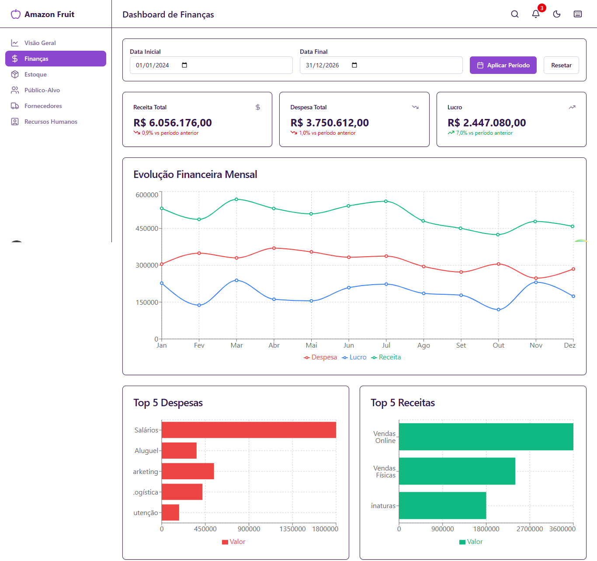
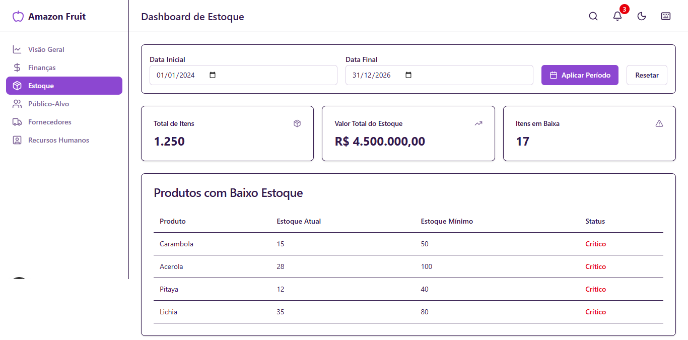
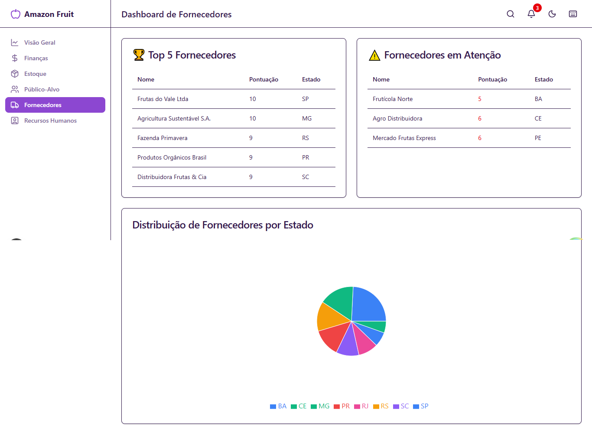

# 🍎 Amazon Fruit - Dashboard de Gestão

> Sistema completo de dashboards para gestão de negócios, construído com Next.js 16, React 19 e TypeScript 5.

[](https://github.com/seu-usuario/amazon-fruit/actions/workflows/ci.yml)
[](https://www.typescriptlang.org/)
[](https://nextjs.org/)
[](https://reactjs.org/)

## 📖 Sobre o Projeto

Amazon Fruit é uma aplicação web moderna para gestão empresarial, oferecendo dashboards interativos para análise de:

- 📊 Visão geral do negócio
- 💰 Finanças e fluxo de caixa
- 📦 Controle de estoque
- 👥 Análise de público-alvo
- 🏭 Gestão de fornecedores
- 👔 Recursos humanos

## 🖼️ Demonstração

> 💡 **Nota:** Adicione suas screenshots na pasta `public/images/` e atualize os caminhos abaixo.

### Dashboard Principal


### Funcionalidades em Ação

<div align="center">
  
  
</div>

<div align="center">
  
  
</div>

### Recursos Visuais


## ✨ Funcionalidades Principais

### 📊 Dashboards Especializados

- **Dashboard Geral** - KPIs principais e evolução financeira em tempo real
- **Dashboard de Finanças** - Análise detalhada de receitas, despesas e fluxo de caixa
- **Dashboard de Estoque** - Controle de produtos, alertas de baixo estoque e movimentações
- **Dashboard de Público-Alvo** - Segmentação demográfica e análise de comportamento
- **Dashboard de Fornecedores** - Ranking, avaliação de performance e histórico
- **Dashboard de RH** - Headcount, custos operacionais e gestão de contratações

### 🚀 Funcionalidades Avançadas

- 🔍 **Busca Global** - Pesquisa rápida em todos os dashboards (atalho: `Ctrl+K`)
- 🔔 **Sistema de Alertas** - Notificações em tempo real para eventos importantes
- 📤 **Exportação de Dados** - Relatórios em PDF, Excel e CSV
- ⌨️ **Atalhos de Teclado** - Navegação rápida e eficiente
- 🎨 **Temas Personalizados** - Modo claro e escuro com preferências salvas
- 📱 **Design Responsivo** - Experiência otimizada para mobile e desktop

## 🚀 Início Rápido

### Pré-requisitos

- Node.js 20.x ou superior
- npm 10.x ou superior

### Instalação

1. **Clone o repositório:**

```bash
git clone https://github.com/seu-usuario/amazon-fruit.git
cd amazon-fruit
```

2. **Instale as dependências:**

```bash
npm install
```

3. **Configure as variáveis de ambiente:**

```bash
cp .env.example .env.local
```

Edite `.env.local` com suas configurações:

```env
NEXT_PUBLIC_API_URL=http://localhost:8000
NEXT_PUBLIC_APP_NAME=Amazon Fruit
```

4. **Inicie o servidor de desenvolvimento:**

```bash
npm run dev
```

Acesse [http://localhost:3000](http://localhost:3000) no seu navegador.

## 📚 Scripts Disponíveis

| Script | Descrição |
|--------|-----------|
| `npm run dev` | Inicia servidor de desenvolvimento |
| `npm run build` | Compila para produção |
| `npm start` | Inicia servidor de produção |
| `npm test` | Executa testes unitários |
| `npm run lint` | Executa linter |
| `npm run type-check` | Verifica tipos TypeScript |
| `npm run format` | Formata código com Prettier |

## 🛠️ Tecnologias

### Stack Principal

- **[Next.js 16](https://nextjs.org/)** - Framework React com App Router e Turbopack
- **[React 19](https://react.dev/)** - Biblioteca UI com Server Components
- **[TypeScript 5](https://www.typescriptlang.org/)** - Tipagem estática

### Bibliotecas Principais

- **[Zustand](https://zustand-demo.pmnd.rs/)** - Gerenciamento de estado global
- **[TanStack Query](https://tanstack.com/query)** - Data fetching e caching
- **[Tailwind CSS v4](https://tailwindcss.com/)** - Framework CSS utility-first
- **[Recharts](https://recharts.org/)** - Biblioteca de gráficos interativos
- **[Lucide React](https://lucide.dev/)** - Ícones SVG
- **[Sonner](https://sonner.emilkowal.ski/)** - Toast notifications

### Ferramentas de Desenvolvimento

- **[Jest](https://jestjs.org/)** - Framework de testes
- **[Testing Library](https://testing-library.com/)** - Testes de componentes
- **[ESLint](https://eslint.org/)** - Linter
- **[Prettier](https://prettier.io/)** - Formatador de código

## 🧪 Testes

Execute os testes:

```bash
npm test
```

Testes com cobertura:

```bash
npm test -- --coverage
```

**Status atual:**
- ✅ 58 testes implementados
- ✅ 100% taxa de sucesso
- ✅ Cobertura de componentes UI, Hooks, Features e Dashboards

## 🐳 Deploy

### Docker

```bash
# Build da imagem
docker build -t amazon-fruit .

# Executar container
docker run -p 3000:3000 amazon-fruit

# Ou com Docker Compose
docker-compose up -d
```

### Vercel (Recomendado)

1. Faça push para o GitHub
2. Conecte seu repositório no [Vercel](https://vercel.com)
3. Configure as variáveis de ambiente
4. Deploy automático a cada push!

### Outras Plataformas

- **Netlify** - Compatível com SSG/SSR
- **Railway** - Deploy com Docker
- **AWS/GCP/Azure** - Deploy com containers

## 📁 Estrutura do Projeto

```
amazon-fruit/
├── src/
│   ├── app/                  # App Router (Next.js 16)
│   │   ├── (dashboards)/     # Rotas dos dashboards
│   │   ├── layout.tsx        # Layout raiz
│   │   └── page.tsx          # Página inicial
│   ├── components/           # Componentes React
│   │   ├── charts/           # Componentes de gráficos
│   │   ├── dashboards/       # Componentes de dashboards
│   │   ├── features/         # Features (alertas, busca, etc)
│   │   ├── layouts/          # Layouts (header, sidebar, footer)
│   │   └── ui/               # Componentes UI base
│   ├── lib/                  # Bibliotecas e utilidades
│   │   ├── api/              # Cliente API e serviços
│   │   ├── hooks/            # Hooks customizados
│   │   ├── providers/        # Providers (Query, Theme)
│   │   └── utils/            # Funções utilitárias
│   ├── store/                # Zustand stores
│   ├── styles/               # Estilos globais
│   └── types/                # Definições TypeScript
├── public/                   # Assets estáticos
│   └── images/               # Screenshots e imagens
├── tests/                    # Testes e helpers
└── docs/                     # Documentação
```

### Padrões de Código

- ✅ TypeScript strict mode
- ✅ ESLint configurado
- ✅ Prettier para formatação
- ✅ Testes obrigatórios para novas features

## 📄 Licença

Este projeto está sob a licença MIT. Veja o arquivo [LICENSE](LICENSE) para mais detalhes.

## 👥 Autor

- **Jonata Jesus** - Desenvolvedor Frontend - [GitHub](https://github.com/jonata1200)
